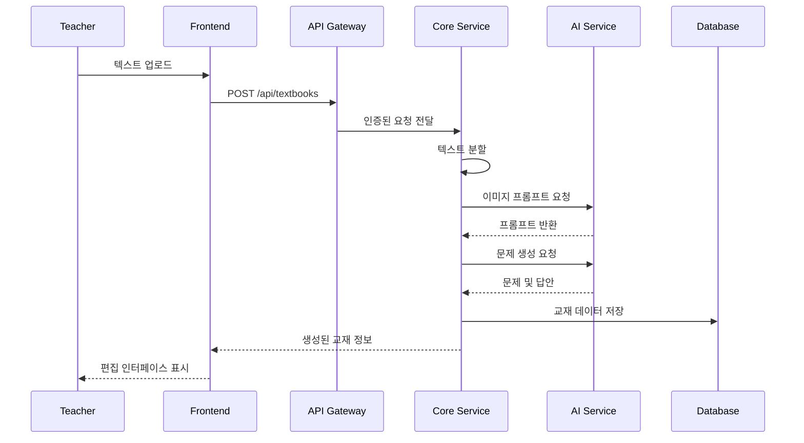
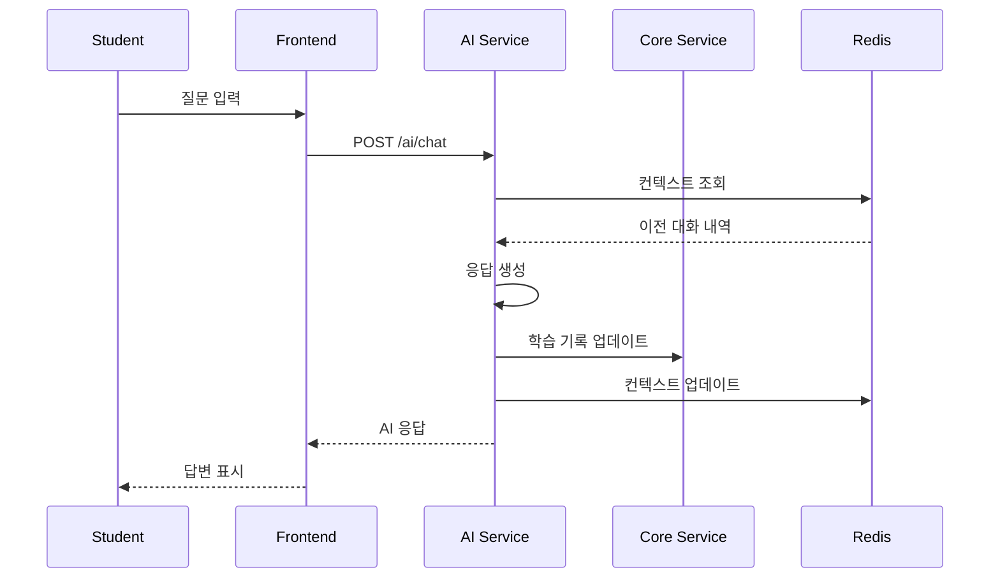

# 시스템 아키텍처

## 목차
- [전체 아키텍처](#전체-아키텍처)
- [마이크로서비스 구조](#마이크로서비스-구조)
- [데이터 흐름](#데이터-흐름)
- [기술 스택 상세](#기술-스택-상세)
- [보안 아키텍처](#보안-아키텍처)
- [확장성 전략](#확장성-전략)

## 전체 아키텍처

### 시스템 개요
```
┌─────────────────────────────────────────────────────────────┐
│                        사용자 레이어                           │
├─────────────────────┬───────────────────┬───────────────────┤
│   교사 웹앱 (Next.js) │  학생 웹앱 (Next.js) │   모바일 앱 (계획)  │
└─────────────────────┴───────────────────┴───────────────────┘
                               │
                               ▼
┌─────────────────────────────────────────────────────────────┐
│                    Load Balancer (Nginx)                     │
└─────────────────────────────────────────────────────────────┘
                               │
                               ▼
┌─────────────────────────────────────────────────────────────┐
│                       API Gateway                            │
│                 (인증, 라우팅, 속도 제한)                        │
└─────────────────────────────────────────────────────────────┘
                               │
        ┌──────────────────────┼──────────────────────┐
        │                      │                      │
        ▼                      ▼                      ▼
┌───────────────┐     ┌───────────────┐     ┌───────────────┐
│ Auth Service  │     │ Core Service  │     │  AI Service   │
│               │     │               │     │               │
│ - 사용자 인증   │     │ - 교재 관리     │     │ - 텍스트 분석   │
│ - 권한 관리     │     │ - 학습 진도     │     │ - 이미지 생성   │
│ - 세션 관리     │     │ - 평가 관리     │     │ - AI 튜터링    │
└───────────────┘     └───────────────┘     └───────────────┘
        │                      │                      │
        └──────────────────────┼──────────────────────┘
                               │
                    ┌──────────┴──────────┐
                    │                     │
            ┌───────▼──────┐     ┌───────▼──────┐
            │  PostgreSQL  │     │    Redis     │
            │              │     │              │
            │ - 영구 데이터  │     │ - 캐시       │
            │ - 트랜잭션    │     │ - 세션       │
            └──────────────┘     └──────────────┘
```

## 마이크로서비스 구조

### 1. Auth Service (인증 서비스)
```
auth-service/
├── src/
│   ├── controllers/
│   │   ├── auth.controller.ts      # 로그인/로그아웃
│   │   └── user.controller.ts      # 사용자 관리
│   ├── services/
│   │   ├── jwt.service.ts          # JWT 토큰 관리
│   │   ├── password.service.ts     # 비밀번호 암호화
│   │   └── session.service.ts      # 세션 관리
│   ├── middleware/
│   │   ├── authenticate.ts         # 인증 미들웨어
│   │   └── authorize.ts            # 권한 검사
│   └── models/
│       └── user.model.ts           # 사용자 모델
```

**책임:**
- 사용자 등록 및 로그인
- JWT 토큰 발급 및 검증
- 역할 기반 접근 제어 (RBAC)
- 비밀번호 재설정

### 2. Core Service (핵심 서비스)
```
core-service/
├── src/
│   ├── textbook/
│   │   ├── textbook.controller.ts
│   │   ├── textbook.service.ts
│   │   └── segmenter.service.ts    # 텍스트 분할
│   ├── assessment/
│   │   ├── question.service.ts     # 문제 생성
│   │   └── evaluation.service.ts   # 평가 관리
│   ├── progress/
│   │   ├── tracking.service.ts     # 진도 추적
│   │   └── analytics.service.ts    # 학습 분석
│   └── shared/
│       └── korean-nlp.utils.ts     # 한국어 처리
```

**책임:**
- 교재 생성 및 관리
- 텍스트 자동 분할
- 학습 진도 추적
- 평가 및 피드백 관리

### 3. AI Service (AI 서비스)
```
ai-service/
├── src/
│   ├── tutor/
│   │   ├── chat.controller.ts
│   │   ├── context.service.ts      # 대화 컨텍스트
│   │   └── coaching.service.ts     # 학습 코칭
│   ├── image-generator/
│   │   ├── prompt.service.ts       # 프롬프트 생성
│   │   └── dalle.service.ts        # DALL-E 통합
│   ├── text-analyzer/
│   │   ├── difficulty.service.ts   # 난이도 분석
│   │   └── keyword.service.ts      # 키워드 추출
│   └── writing-evaluator/
│       ├── structure.analyzer.ts   # 구조 분석
│       └── feedback.generator.ts   # 피드백 생성
```

**책임:**
- AI 튜터 대화 처리
- 이미지 프롬프트 생성 및 이미지 생성
- 텍스트 난이도 분석
- 글쓰기 자동 평가

## 데이터 흐름

### 1. 교재 생성 플로우


### 2. 학습 세션 플로우


## 기술 스택 상세

### Backend 기술

#### Node.js & TypeScript
- **버전**: Node.js 18 LTS, TypeScript 5.0+
- **선택 이유**: 
  - 비동기 처리에 최적화
  - 풍부한 NPM 생태계
  - 타입 안정성

#### Express.js
- **용도**: RESTful API 서버
- **미들웨어**:
  - `cors`: CORS 처리
  - `helmet`: 보안 헤더
  - `compression`: 응답 압축
  - `express-rate-limit`: API 속도 제한

#### PostgreSQL
- **버전**: 15+
- **용도**: 
  - 사용자 데이터
  - 교재 콘텐츠
  - 학습 기록
- **최적화**:
  - 인덱싱 전략
  - 파티셔닝 (학습 기록)
  - 읽기 전용 복제본

#### Redis
- **버전**: 7+
- **용도**:
  - 세션 저장소
  - AI 응답 캐싱
  - 실시간 학습 상태
  - Pub/Sub (실시간 알림)

### Frontend 기술

#### Next.js 14
- **기능**:
  - App Router 사용
  - Server Components
  - Streaming SSR
- **최적화**:
  - 이미지 최적화
  - 폰트 최적화
  - 번들 크기 최소화

#### 상태 관리
- **Zustand**: 클라이언트 상태
- **React Query**: 서버 상태
- **Context API**: 전역 설정

### AI 통합

#### Claude API
- **용도**: 
  - 자연어 이해
  - 학습 대화 생성
  - 텍스트 분석
- **최적화**:
  - 프롬프트 엔지니어링
  - 응답 캐싱
  - 토큰 사용 최적화

#### DALL-E 3
- **용도**: 교재 이미지 생성
- **프로세스**:
  1. 텍스트에서 키워드 추출
  2. 교육적 이미지 프롬프트 생성
  3. 이미지 생성 및 최적화

## 보안 아키텍처

### 인증 및 권한

#### JWT 구조
```json
{
  "header": {
    "alg": "RS256",
    "typ": "JWT"
  },
  "payload": {
    "sub": "user-uuid",
    "email": "user@school.com",
    "role": "teacher",
    "schoolId": "school-uuid",
    "iat": 1234567890,
    "exp": 1234567890
  }
}
```

#### 권한 체계
```typescript
enum Role {
  STUDENT = 'student',
  TEACHER = 'teacher',
  ADMIN = 'admin'
}

enum Permission {
  // 교재 권한
  CREATE_TEXTBOOK = 'textbook:create',
  EDIT_TEXTBOOK = 'textbook:edit',
  DELETE_TEXTBOOK = 'textbook:delete',
  VIEW_TEXTBOOK = 'textbook:view',
  
  // 학생 관리
  VIEW_STUDENT_PROGRESS = 'student:progress:view',
  MANAGE_STUDENTS = 'student:manage',
  
  // AI 기능
  USE_AI_TUTOR = 'ai:tutor:use',
  USE_AI_EVALUATOR = 'ai:evaluator:use'
}
```

### 데이터 보안

#### 암호화
- **저장 시**: AES-256 암호화
- **전송 시**: TLS 1.3
- **비밀번호**: bcrypt (라운드 12)

#### 개인정보 보호
- PII 데이터 마스킹
- 로그에서 민감 정보 제외
- GDPR 준수 (삭제 요청 처리)

## 확장성 전략

### 수평 확장

#### Pod 자동 확장
```yaml
apiVersion: autoscaling/v2
kind: HorizontalPodAutoscaler
metadata:
  name: core-service-hpa
spec:
  scaleTargetRef:
    apiVersion: apps/v1
    kind: Deployment
    name: core-service
  minReplicas: 2
  maxReplicas: 10
  metrics:
  - type: Resource
    resource:
      name: cpu
      target:
        type: Utilization
        averageUtilization: 70
  - type: Resource
    resource:
      name: memory
      target:
        type: Utilization
        averageUtilization: 80
```

### 캐싱 전략

#### 다층 캐싱
1. **CDN**: 정적 자산 (이미지, CSS, JS)
2. **Redis**: API 응답, 세션 데이터
3. **In-Memory**: 자주 사용되는 설정값

#### 캐시 무효화
```typescript
class CacheManager {
  async invalidate(pattern: string) {
    // Redis 패턴 매칭으로 캐시 삭제
    const keys = await redis.keys(pattern);
    if (keys.length > 0) {
      await redis.del(...keys);
    }
  }
}
```

### 성능 최적화

#### 데이터베이스 최적화
- 커넥션 풀링
- 쿼리 최적화
- 인덱스 전략
- 읽기 전용 복제본 활용

#### API 최적화
- GraphQL 도입 검토 (오버페칭 방지)
- 배치 처리
- 비동기 작업 큐 (BullMQ)

### 모니터링 아키텍처

#### 메트릭 수집
```
┌─────────────┐     ┌─────────────┐     ┌─────────────┐
│   Services  │────▶│ Prometheus  │────▶│   Grafana   │
└─────────────┘     └─────────────┘     └─────────────┘
                            │
                            ▼
                    ┌─────────────┐
                    │ AlertManager│
                    └─────────────┘
```

#### 주요 모니터링 지표
- API 응답 시간 (P50, P95, P99)
- 에러율
- 활성 사용자 수
- AI API 사용량
- 데이터베이스 성능

## 재해 복구 전략

### 백업 정책
- **데이터베이스**: 일일 전체 백업, 시간별 증분 백업
- **파일 스토리지**: S3 교차 리전 복제
- **설정 및 시크릿**: Git 암호화 저장

### 복구 절차
1. 서비스 상태 확인
2. 데이터 무결성 검증
3. 단계별 서비스 복구
4. 헬스체크 및 모니터링

---

이 아키텍처는 지속적으로 발전하며, 사용자 피드백과 시스템 요구사항에 따라 업데이트됩니다.