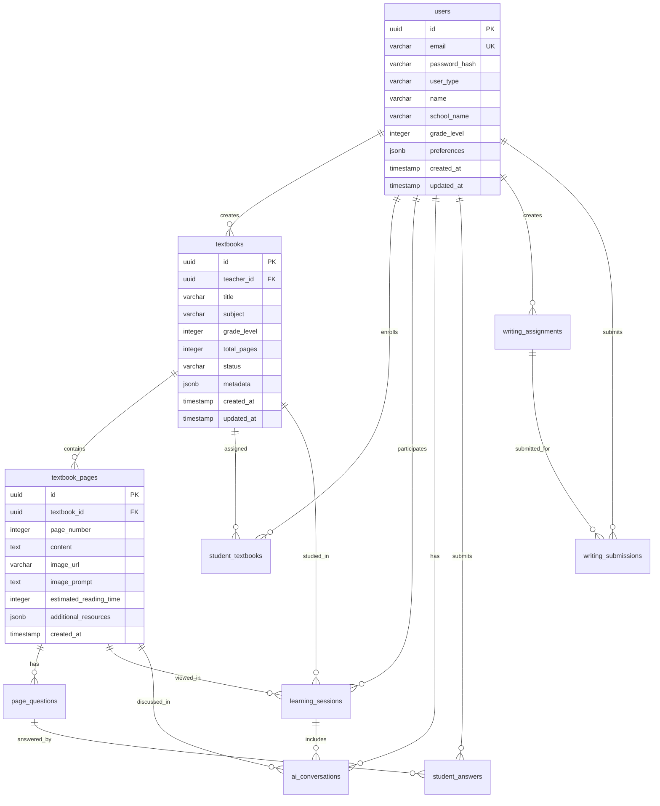

# 데이터베이스 스키마

## 목차
- [개요](#개요)
- [ERD (Entity Relationship Diagram)](#erd)
- [테이블 상세](#테이블-상세)
- [인덱스 전략](#인덱스-전략)
- [파티셔닝](#파티셔닝)
- [트리거 및 함수](#트리거-및-함수)
- [마이그레이션 가이드](#마이그레이션-가이드)

## 개요

### 데이터베이스 정보
- **DBMS**: PostgreSQL 15+
- **문자 인코딩**: UTF-8
- **시간대**: UTC
- **명명 규칙**: snake_case

### 주요 설계 원칙
1. **정규화**: 3NF (Third Normal Form) 준수
2. **무결성**: 외래 키 제약조건 엄격 적용
3. **성능**: 적절한 인덱싱 및 파티셔닝
4. **확장성**: 샤딩을 고려한 UUID 사용

## ERD



## 테이블 상세

### 1. users (사용자)
사용자 정보를 저장하는 핵심 테이블

```sql
CREATE TABLE users (
    id UUID PRIMARY KEY DEFAULT gen_random_uuid(),
    email VARCHAR(255) UNIQUE NOT NULL,
    password_hash VARCHAR(255) NOT NULL,
    user_type VARCHAR(20) NOT NULL CHECK (user_type IN ('teacher', 'student', 'admin')),
    name VARCHAR(100) NOT NULL,
    school_name VARCHAR(100),
    grade_level INTEGER CHECK (grade_level BETWEEN 1 AND 3),
    phone_number VARCHAR(20),
    profile_image_url VARCHAR(500),
    is_active BOOLEAN DEFAULT true,
    email_verified BOOLEAN DEFAULT false,
    preferences JSONB DEFAULT '{}',
    last_login_at TIMESTAMP,
    created_at TIMESTAMP DEFAULT CURRENT_TIMESTAMP,
    updated_at TIMESTAMP DEFAULT CURRENT_TIMESTAMP
);

-- 인덱스
CREATE INDEX idx_users_email ON users(email);
CREATE INDEX idx_users_user_type ON users(user_type);
CREATE INDEX idx_users_school_name ON users(school_name) WHERE school_name IS NOT NULL;
```

### 2. textbooks (교재)
교사가 생성한 교재 정보

```sql
CREATE TABLE textbooks (
    id UUID PRIMARY KEY DEFAULT gen_random_uuid(),
    teacher_id UUID REFERENCES users(id) ON DELETE CASCADE,
    title VARCHAR(255) NOT NULL,
    description TEXT,
    subject VARCHAR(50),
    grade_level INTEGER CHECK (grade_level BETWEEN 1 AND 3),
    total_pages INTEGER DEFAULT 0,
    cover_image_url VARCHAR(500),
    status VARCHAR(20) DEFAULT 'draft' CHECK (status IN ('draft', 'published', 'archived')),
    published_at TIMESTAMP,
    metadata JSONB DEFAULT '{}',
    view_count INTEGER DEFAULT 0,
    created_at TIMESTAMP DEFAULT CURRENT_TIMESTAMP,
    updated_at TIMESTAMP DEFAULT CURRENT_TIMESTAMP
);

-- 인덱스
CREATE INDEX idx_textbooks_teacher_id ON textbooks(teacher_id);
CREATE INDEX idx_textbooks_status ON textbooks(status);
CREATE INDEX idx_textbooks_subject_grade ON textbooks(subject, grade_level);
CREATE INDEX idx_textbooks_created_at ON textbooks(created_at DESC);
```

### 3. textbook_pages (교재 페이지)
교재의 각 페이지 내용

```sql
CREATE TABLE textbook_pages (
    id UUID PRIMARY KEY DEFAULT gen_random_uuid(),
    textbook_id UUID REFERENCES textbooks(id) ON DELETE CASCADE,
    page_number INTEGER NOT NULL,
    content TEXT NOT NULL,
    content_hash VARCHAR(64), -- 중복 콘텐츠 검사용
    image_url VARCHAR(500),
    image_prompt TEXT,
    image_generation_status VARCHAR(20) DEFAULT 'pending',
    estimated_reading_time INTEGER, -- 초 단위
    difficulty_level INTEGER CHECK (difficulty_level BETWEEN 1 AND 5),
    keywords TEXT[], -- 주요 키워드 배열
    additional_resources JSONB DEFAULT '{}',
    created_at TIMESTAMP DEFAULT CURRENT_TIMESTAMP,
    updated_at TIMESTAMP DEFAULT CURRENT_TIMESTAMP,
    UNIQUE(textbook_id, page_number)
);

-- 인덱스
CREATE INDEX idx_textbook_pages_textbook_id ON textbook_pages(textbook_id);
CREATE INDEX idx_textbook_pages_keywords ON textbook_pages USING GIN(keywords);
```

### 4. page_questions (페이지 문제)
각 페이지에 포함된 학습 문제

```sql
CREATE TABLE page_questions (
    id UUID PRIMARY KEY DEFAULT gen_random_uuid(),
    page_id UUID REFERENCES textbook_pages(id) ON DELETE CASCADE,
    question_text TEXT NOT NULL,
    question_type VARCHAR(50) NOT NULL CHECK (
        question_type IN ('multiple_choice', 'short_answer', 'essay', 'true_false')
    ),
    suggested_answer TEXT NOT NULL,
    answer_explanation TEXT,
    hints TEXT[],
    difficulty_level INTEGER CHECK (difficulty_level BETWEEN 1 AND 5),
    points INTEGER DEFAULT 10,
    order_index INTEGER NOT NULL,
    metadata JSONB DEFAULT '{}',
    created_at TIMESTAMP DEFAULT CURRENT_TIMESTAMP
);

-- 인덱스
CREATE INDEX idx_page_questions_page_id ON page_questions(page_id);
CREATE INDEX idx_page_questions_type ON page_questions(question_type);
```

### 5. student_textbooks (학생-교재 연결)
학생에게 할당된 교재

```sql
CREATE TABLE student_textbooks (
    id UUID PRIMARY KEY DEFAULT gen_random_uuid(),
    student_id UUID REFERENCES users(id) ON DELETE CASCADE,
    textbook_id UUID REFERENCES textbooks(id) ON DELETE CASCADE,
    assigned_by UUID REFERENCES users(id),
    assigned_at TIMESTAMP DEFAULT CURRENT_TIMESTAMP,
    started_at TIMESTAMP,
    completed_at TIMESTAMP,
    current_page INTEGER DEFAULT 1,
    completion_rate DECIMAL(5,2) DEFAULT 0.00,
    total_time_spent INTEGER DEFAULT 0, -- 초 단위
    last_accessed_at TIMESTAMP,
    UNIQUE(student_id, textbook_id)
);

-- 인덱스
CREATE INDEX idx_student_textbooks_student_id ON student_textbooks(student_id);
CREATE INDEX idx_student_textbooks_textbook_id ON student_textbooks(textbook_id);
CREATE INDEX idx_student_textbooks_completion ON student_textbooks(completion_rate);
```

### 6. learning_sessions (학습 세션)
학생의 학습 세션 기록

```sql
CREATE TABLE learning_sessions (
    id UUID PRIMARY KEY DEFAULT gen_random_uuid(),
    student_id UUID REFERENCES users(id) ON DELETE CASCADE,
    textbook_id UUID REFERENCES textbooks(id) ON DELETE CASCADE,
    page_id UUID REFERENCES textbook_pages(id) ON DELETE CASCADE,
    session_type VARCHAR(20) DEFAULT 'reading',
    started_at TIMESTAMP DEFAULT CURRENT_TIMESTAMP,
    ended_at TIMESTAMP,
    duration_seconds INTEGER,
    ai_interactions_count INTEGER DEFAULT 0,
    questions_attempted INTEGER DEFAULT 0,
    questions_correct INTEGER DEFAULT 0,
    device_info JSONB,
    ip_address INET,
    created_at TIMESTAMP DEFAULT CURRENT_TIMESTAMP
);

-- 인덱스
CREATE INDEX idx_learning_sessions_student_id ON learning_sessions(student_id);
CREATE INDEX idx_learning_sessions_started_at ON learning_sessions(started_at DESC);
CREATE INDEX idx_learning_sessions_textbook_page ON learning_sessions(textbook_id, page_id);
```

### 7. ai_conversations (AI 대화)
학생과 AI 튜터 간의 대화 기록

```sql
CREATE TABLE ai_conversations (
    id UUID PRIMARY KEY DEFAULT gen_random_uuid(),
    session_id UUID REFERENCES learning_sessions(id) ON DELETE CASCADE,
    student_id UUID REFERENCES users(id) ON DELETE CASCADE,
    page_id UUID REFERENCES textbook_pages(id),
    conversation_thread_id UUID,
    message_type VARCHAR(20) CHECK (message_type IN ('student', 'ai', 'system')),
    message_content TEXT NOT NULL,
    tokens_used INTEGER,
    response_time_ms INTEGER,
    feedback_rating INTEGER CHECK (feedback_rating BETWEEN 1 AND 5),
    metadata JSONB DEFAULT '{}',
    created_at TIMESTAMP DEFAULT CURRENT_TIMESTAMP
);

-- 인덱스
CREATE INDEX idx_ai_conversations_session_id ON ai_conversations(session_id);
CREATE INDEX idx_ai_conversations_thread_id ON ai_conversations(conversation_thread_id);
CREATE INDEX idx_ai_conversations_created_at ON ai_conversations(created_at DESC);
```

### 8. student_answers (학생 답변)
학생이 제출한 문제 답변

```sql
CREATE TABLE student_answers (
    id UUID PRIMARY KEY DEFAULT gen_random_uuid(),
    student_id UUID REFERENCES users(id) ON DELETE CASCADE,
    question_id UUID REFERENCES page_questions(id) ON DELETE CASCADE,
    session_id UUID REFERENCES learning_sessions(id),
    answer_text TEXT NOT NULL,
    is_correct BOOLEAN,
    score DECIMAL(5,2),
    time_spent_seconds INTEGER,
    attempt_number INTEGER DEFAULT 1,
    ai_feedback TEXT,
    teacher_feedback TEXT,
    submitted_at TIMESTAMP DEFAULT CURRENT_TIMESTAMP,
    reviewed_at TIMESTAMP,
    reviewed_by UUID REFERENCES users(id)
);

-- 인덱스
CREATE INDEX idx_student_answers_student_id ON student_answers(student_id);
CREATE INDEX idx_student_answers_question_id ON student_answers(question_id);
CREATE INDEX idx_student_answers_submitted_at ON student_answers(submitted_at DESC);
```

### 9. writing_assignments (쓰기 과제)
교사가 생성한 쓰기 과제

```sql
CREATE TABLE writing_assignments (
    id UUID PRIMARY KEY DEFAULT gen_random_uuid(),
    teacher_id UUID REFERENCES users(id) ON DELETE CASCADE,
    title VARCHAR(255) NOT NULL,
    prompt TEXT NOT NULL,
    genre VARCHAR(50) CHECK (
        genre IN ('narrative', 'argumentative', 'expository', 'descriptive', 'creative')
    ),
    requirements JSONB DEFAULT '{}',
    rubric JSONB DEFAULT '{}',
    min_length INTEGER,
    max_length INTEGER,
    due_date TIMESTAMP,
    allow_late_submission BOOLEAN DEFAULT false,
    published BOOLEAN DEFAULT false,
    created_at TIMESTAMP DEFAULT CURRENT_TIMESTAMP,
    updated_at TIMESTAMP DEFAULT CURRENT_TIMESTAMP
);

-- 인덱스
CREATE INDEX idx_writing_assignments_teacher_id ON writing_assignments(teacher_id);
CREATE INDEX idx_writing_assignments_due_date ON writing_assignments(due_date);
CREATE INDEX idx_writing_assignments_published ON writing_assignments(published);
```

### 10. writing_submissions (쓰기 제출)
학생의 쓰기 과제 제출

```sql
CREATE TABLE writing_submissions (
    id UUID PRIMARY KEY DEFAULT gen_random_uuid(),
    assignment_id UUID REFERENCES writing_assignments(id) ON DELETE CASCADE,
    student_id UUID REFERENCES users(id) ON DELETE CASCADE,
    content TEXT NOT NULL,
    word_count INTEGER,
    character_count INTEGER,
    is_draft BOOLEAN DEFAULT false,
    submitted_at TIMESTAMP DEFAULT CURRENT_TIMESTAMP,
    updated_at TIMESTAMP DEFAULT CURRENT_TIMESTAMP,
    ai_evaluation JSONB,
    ai_evaluated_at TIMESTAMP,
    teacher_evaluation JSONB,
    teacher_evaluated_at TIMESTAMP,
    final_score DECIMAL(5,2),
    plagiarism_check JSONB,
    version INTEGER DEFAULT 1,
    UNIQUE(assignment_id, student_id)
);

-- 인덱스
CREATE INDEX idx_writing_submissions_assignment_id ON writing_submissions(assignment_id);
CREATE INDEX idx_writing_submissions_student_id ON writing_submissions(student_id);
CREATE INDEX idx_writing_submissions_submitted_at ON writing_submissions(submitted_at DESC);
```

### 11. 추가 테이블들

#### class_groups (학급)
```sql
CREATE TABLE class_groups (
    id UUID PRIMARY KEY DEFAULT gen_random_uuid(),
    teacher_id UUID REFERENCES users(id) ON DELETE CASCADE,
    name VARCHAR(100) NOT NULL,
    school_year INTEGER,
    grade_level INTEGER,
    student_count INTEGER DEFAULT 0,
    is_active BOOLEAN DEFAULT true,
    created_at TIMESTAMP DEFAULT CURRENT_TIMESTAMP
);

CREATE TABLE class_students (
    class_id UUID REFERENCES class_groups(id) ON DELETE CASCADE,
    student_id UUID REFERENCES users(id) ON DELETE CASCADE,
    joined_at TIMESTAMP DEFAULT CURRENT_TIMESTAMP,
    PRIMARY KEY (class_id, student_id)
);
```

#### notifications (알림)
```sql
CREATE TABLE notifications (
    id UUID PRIMARY KEY DEFAULT gen_random_uuid(),
    user_id UUID REFERENCES users(id) ON DELETE CASCADE,
    type VARCHAR(50) NOT NULL,
    title VARCHAR(255) NOT NULL,
    message TEXT,
    data JSONB DEFAULT '{}',
    is_read BOOLEAN DEFAULT false,
    created_at TIMESTAMP DEFAULT CURRENT_TIMESTAMP
);

CREATE INDEX idx_notifications_user_unread ON notifications(user_id, is_read) 
WHERE is_read = false;
```

## 인덱스 전략

### 기본 인덱스 원칙
1. **Primary Key**: 모든 테이블에 UUID 기반 PK
2. **Foreign Key**: 자동 생성되는 FK 인덱스 활용
3. **자주 조회되는 컬럼**: 단일 또는 복합 인덱스
4. **부분 인덱스**: WHERE 조건이 있는 경우 활용

### 성능 최적화 인덱스
```sql
-- 복합 인덱스 예시
CREATE INDEX idx_student_progress ON student_textbooks(student_id, textbook_id, completion_rate);

-- 부분 인덱스 예시
CREATE INDEX idx_active_sessions ON learning_sessions(student_id, started_at) 
WHERE ended_at IS NULL;

-- 표현식 인덱스 예시
CREATE INDEX idx_users_lower_email ON users(LOWER(email));

-- JSONB 인덱스 예시
CREATE INDEX idx_textbook_metadata ON textbooks USING GIN(metadata);
```

## 파티셔닝

### learning_sessions 파티셔닝
대용량 로그 데이터를 월별로 파티셔닝

```sql
-- 파티션 테이블 생성
CREATE TABLE learning_sessions_partitioned (
    LIKE learning_sessions INCLUDING ALL
) PARTITION BY RANGE (started_at);

-- 월별 파티션 생성
CREATE TABLE learning_sessions_2024_01 
PARTITION OF learning_sessions_partitioned
FOR VALUES FROM ('2024-01-01') TO ('2024-02-01');

CREATE TABLE learning_sessions_2024_02 
PARTITION OF learning_sessions_partitioned
FOR VALUES FROM ('2024-02-01') TO ('2024-03-01');

-- 자동 파티션 생성 함수
CREATE OR REPLACE FUNCTION create_monthly_partition()
RETURNS void AS $$
DECLARE
    start_date date;
    end_date date;
    partition_name text;
BEGIN
    start_date := date_trunc('month', CURRENT_DATE);
    end_date := start_date + interval '1 month';
    partition_name := 'learning_sessions_' || to_char(start_date, 'YYYY_MM');
    
    EXECUTE format('CREATE TABLE IF NOT EXISTS %I PARTITION OF learning_sessions_partitioned FOR VALUES FROM (%L) TO (%L)',
        partition_name, start_date, end_date);
END;
$$ LANGUAGE plpgsql;
```

## 트리거 및 함수

### 1. 자동 updated_at 갱신
```sql
CREATE OR REPLACE FUNCTION update_updated_at_column()
RETURNS TRIGGER AS $$
BEGIN
    NEW.updated_at = CURRENT_TIMESTAMP;
    RETURN NEW;
END;
$$ LANGUAGE plpgsql;

-- 트리거 적용
CREATE TRIGGER update_users_updated_at BEFORE UPDATE ON users
FOR EACH ROW EXECUTE FUNCTION update_updated_at_column();

CREATE TRIGGER update_textbooks_updated_at BEFORE UPDATE ON textbooks
FOR EACH ROW EXECUTE FUNCTION update_updated_at_column();
```

### 2. 페이지 수 자동 갱신
```sql
CREATE OR REPLACE FUNCTION update_textbook_page_count()
RETURNS TRIGGER AS $$
BEGIN
    IF TG_OP = 'INSERT' OR TG_OP = 'DELETE' THEN
        UPDATE textbooks 
        SET total_pages = (
            SELECT COUNT(*) FROM textbook_pages 
            WHERE textbook_id = COALESCE(NEW.textbook_id, OLD.textbook_id)
        )
        WHERE id = COALESCE(NEW.textbook_id, OLD.textbook_id);
    END IF;
    RETURN NULL;
END;
$ LANGUAGE plpgsql;

CREATE TRIGGER update_page_count_on_insert
AFTER INSERT OR DELETE ON textbook_pages
FOR EACH ROW EXECUTE FUNCTION update_textbook_page_count();
```

### 3. 학습 진도 자동 계산
```sql
CREATE OR REPLACE FUNCTION calculate_completion_rate()
RETURNS TRIGGER AS $
DECLARE
    total_pages INTEGER;
    completed_pages INTEGER;
    new_rate DECIMAL(5,2);
BEGIN
    -- 전체 페이지 수 조회
    SELECT total_pages INTO total_pages
    FROM textbooks WHERE id = NEW.textbook_id;
    
    -- 완료한 페이지 수 계산 (최소 읽기 시간 충족)
    SELECT COUNT(DISTINCT page_id) INTO completed_pages
    FROM learning_sessions
    WHERE student_id = NEW.student_id 
    AND textbook_id = NEW.textbook_id
    AND duration_seconds >= 60; -- 최소 1분 이상 읽은 페이지
    
    -- 완료율 계산
    IF total_pages > 0 THEN
        new_rate := (completed_pages::DECIMAL / total_pages) * 100;
    ELSE
        new_rate := 0;
    END IF;
    
    -- student_textbooks 업데이트
    UPDATE student_textbooks
    SET completion_rate = new_rate,
        current_page = GREATEST(current_page, 
            (SELECT page_number FROM textbook_pages WHERE id = NEW.page_id)),
        last_accessed_at = CURRENT_TIMESTAMP
    WHERE student_id = NEW.student_id AND textbook_id = NEW.textbook_id;
    
    RETURN NEW;
END;
$ LANGUAGE plpgsql;

CREATE TRIGGER update_completion_rate
AFTER INSERT ON learning_sessions
FOR EACH ROW EXECUTE FUNCTION calculate_completion_rate();
```

### 4. 콘텐츠 해시 생성
```sql
CREATE OR REPLACE FUNCTION generate_content_hash()
RETURNS TRIGGER AS $
BEGIN
    NEW.content_hash := encode(digest(NEW.content, 'sha256'), 'hex');
    RETURN NEW;
END;
$ LANGUAGE plpgsql;

CREATE TRIGGER generate_page_content_hash
BEFORE INSERT OR UPDATE OF content ON textbook_pages
FOR EACH ROW EXECUTE FUNCTION generate_content_hash();
```

## 마이그레이션 가이드

### 마이그레이션 파일 구조
```
database/migrations/
├── 001_initial_schema.sql
├── 002_add_indexes.sql
├── 003_add_triggers.sql
├── 004_add_partitioning.sql
└── 005_add_class_features.sql
```

### 마이그레이션 실행 스크립트
```bash
#!/bin/bash
# scripts/migrate.sh

DB_URL=${DATABASE_URL:-"postgresql://localhost/ai_textbook"}

for file in database/migrations/*.sql; do
    echo "Running migration: $file"
    psql $DB_URL -f $file
done
```

### 롤백 전략
각 마이그레이션에 대응하는 롤백 파일 생성

```sql
-- database/rollbacks/001_initial_schema_rollback.sql
DROP TABLE IF EXISTS writing_submissions CASCADE;
DROP TABLE IF EXISTS writing_assignments CASCADE;
DROP TABLE IF EXISTS student_answers CASCADE;
DROP TABLE IF EXISTS ai_conversations CASCADE;
DROP TABLE IF EXISTS learning_sessions CASCADE;
DROP TABLE IF EXISTS student_textbooks CASCADE;
DROP TABLE IF EXISTS page_questions CASCADE;
DROP TABLE IF EXISTS textbook_pages CASCADE;
DROP TABLE IF EXISTS textbooks CASCADE;
DROP TABLE IF EXISTS users CASCADE;
```

## 데이터베이스 최적화

### 1. 커넥션 풀 설정
```javascript
// 권장 설정
const poolConfig = {
  max: 20,                    // 최대 연결 수
  min: 5,                     // 최소 연결 수
  idleTimeoutMillis: 30000,   // 유휴 타임아웃
  connectionTimeoutMillis: 2000, // 연결 타임아웃
};
```

### 2. 쿼리 최적화 팁
```sql
-- EXPLAIN ANALYZE로 쿼리 분석
EXPLAIN ANALYZE
SELECT t.*, tp.* 
FROM textbooks t
JOIN textbook_pages tp ON t.id = tp.textbook_id
WHERE t.teacher_id = 'uuid' AND t.status = 'published';

-- 통계 정보 업데이트
ANALYZE textbooks;
ANALYZE textbook_pages;

-- 인덱스 사용 강제
SET enable_seqscan = OFF;
```

### 3. 백업 전략
```bash
# 일일 전체 백업
pg_dump -h localhost -U postgres -d ai_textbook -F c -f backup_$(date +%Y%m%d).dump

# 시간별 증분 백업 (WAL 아카이빙)
archive_mode = on
archive_command = 'cp %p /backup/wal/%f'
```

### 4. 모니터링 쿼리
```sql
-- 느린 쿼리 찾기
SELECT query, mean_exec_time, calls
FROM pg_stat_statements
WHERE mean_exec_time > 1000
ORDER BY mean_exec_time DESC
LIMIT 10;

-- 테이블 크기 확인
SELECT schemaname, tablename, 
       pg_size_pretty(pg_total_relation_size(schemaname||'.'||tablename)) as size
FROM pg_tables
WHERE schemaname = 'public'
ORDER BY pg_total_relation_size(schemaname||'.'||tablename) DESC;

-- 인덱스 사용률
SELECT schemaname, tablename, indexname, idx_scan, idx_tup_read, idx_tup_fetch
FROM pg_stat_user_indexes
ORDER BY idx_scan DESC;
```

## 보안 고려사항

### 1. Row Level Security (RLS)
```sql
-- RLS 활성화
ALTER TABLE textbooks ENABLE ROW LEVEL SECURITY;

-- 교사는 자신의 교재만 수정 가능
CREATE POLICY textbook_teacher_policy ON textbooks
FOR ALL TO authenticated_users
USING (teacher_id = current_user_id());

-- 학생은 할당된 교재만 조회 가능
CREATE POLICY textbook_student_policy ON textbooks
FOR SELECT TO authenticated_users
USING (
    EXISTS (
        SELECT 1 FROM student_textbooks st
        WHERE st.textbook_id = textbooks.id
        AND st.student_id = current_user_id()
    )
);
```

### 2. 데이터 암호화
```sql
-- 민감한 데이터 암호화
CREATE EXTENSION IF NOT EXISTS pgcrypto;

-- 개인정보 암호화 예시
UPDATE users 
SET phone_number = pgp_sym_encrypt(phone_number, 'encryption_key')
WHERE phone_number IS NOT NULL;
```

### 3. 감사 로그
```sql
CREATE TABLE audit_log (
    id BIGSERIAL PRIMARY KEY,
    table_name VARCHAR(50),
    operation VARCHAR(10),
    user_id UUID,
    changed_data JSONB,
    created_at TIMESTAMP DEFAULT CURRENT_TIMESTAMP
);

-- 감사 트리거 함수
CREATE OR REPLACE FUNCTION audit_trigger_function()
RETURNS TRIGGER AS $
BEGIN
    INSERT INTO audit_log (table_name, operation, user_id, changed_data)
    VALUES (
        TG_TABLE_NAME,
        TG_OP,
        current_user_id(),
        to_jsonb(NEW)
    );
    RETURN NEW;
END;
$ LANGUAGE plpgsql;
```

## 성능 벤치마크

### 예상 데이터 규모
- 사용자: 100,000명
- 교재: 10,000개
- 페이지: 200,000개
- 학습 세션: 10,000,000개/월
- AI 대화: 50,000,000개/월

### 권장 하드웨어 사양
- CPU: 8 core 이상
- RAM: 32GB 이상
- Storage: NVMe SSD 500GB 이상
- IOPS: 10,000 이상

### 튜닝 파라미터
```ini
# postgresql.conf 권장 설정
shared_buffers = 8GB
effective_cache_size = 24GB
maintenance_work_mem = 2GB
checkpoint_completion_target = 0.9
wal_buffers = 16MB
default_statistics_target = 100
random_page_cost = 1.1
effective_io_concurrency = 200
work_mem = 50MB
min_wal_size = 1GB
max_wal_size = 4GB
max_worker_processes = 8
max_parallel_workers_per_gather = 4
max_parallel_workers = 8
max_connections = 200
```

---

이 문서는 시스템의 성장에 따라 지속적으로 업데이트됩니다. 데이터베이스 변경 시 반드시 마이그레이션 파일을 작성하고 문서를 갱신해주세요.